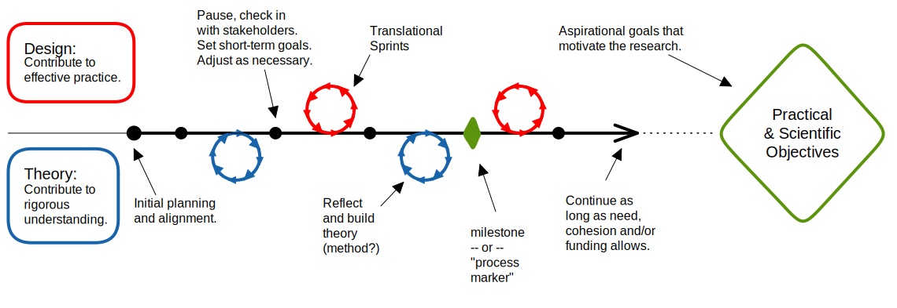

tags:: methodology

-
- 
	- call the theory sprints "[[Synthetic Sprints]]"?
	- areas plugin!
- spare thoughts
	- an imagined new research methodology suited to [[Computing Education Research]]
		- fill out this thought like in [translational sprints](((6401c5cd-5062-4d6a-9bda-41c0af0b1bd7)))
	- a form of [[Participatory CER]]
	- one way to approach [[Translational Research Programmes]]
	- composed in part of [[Translational Sprints]]
	- underpinned by the [TCER Model]([[Computing Education Research as a Translational Transdiscipline]])
	- using "agile" to describe this research is not just to take a buzzword or apply a concept from software development to computing education.
		- the notion of *milestones* in agile development is similar in spirit to *[process markers]([[Evaluating Translational Research: a Process Marker Model]])*.
		- i feel it's appropriate in spirit to use the agile terminology "milestone" instead because CER is more flexible than medical research in many ways, so you can to adjust more easily as circumstances evolve.
		- using the agile terminology is even more appropriate given [[Agile CER]]'s use of [[Translational Sprints]] and [[Synthetic Sprints]] to structure the process markers
	- [[SEED]] can be used to generate research questions, also in [[Translational Sprints]]
	- find notes - comparing/contrasting ACER to design science
- defining [[Agile CER]], sort of rigorously
	- ((6401f8c1-c7c5-49da-8f56-129d6767bf88))
	- **Method** - *techniques used*:
	- **Methodology** - *systematization*:
	- **Theory** - *theoretical stance*:
	- **Philosophical Foundations** - *ontology, axiology, epistemology*:
- [Agile Manifesto](https://agilemanifesto.org/): what could this look like for agile research? #question
	- We are uncovering better ways of developing software by doing it and helping others do it.
		- Through this work we have come to value:
			- **Individuals and interactions** over *processes and tools*
			- **Working software** over *comprehensive documentation*
			- **Customer collaboration** over *contract negotiation*
			- **Responding to change** over *following a plan*
		- That is, while there is value in the items on the right, we value the items on the left more.
		- ideaing:
			- **relationships and wellbeing** over *research deliverables*
				- this will bear more long-term fruit than any specific deliverable
				- [[Negotiating Trust, Power and Culture in a Research-Practice Partnership]]
			-
			-
			-
-