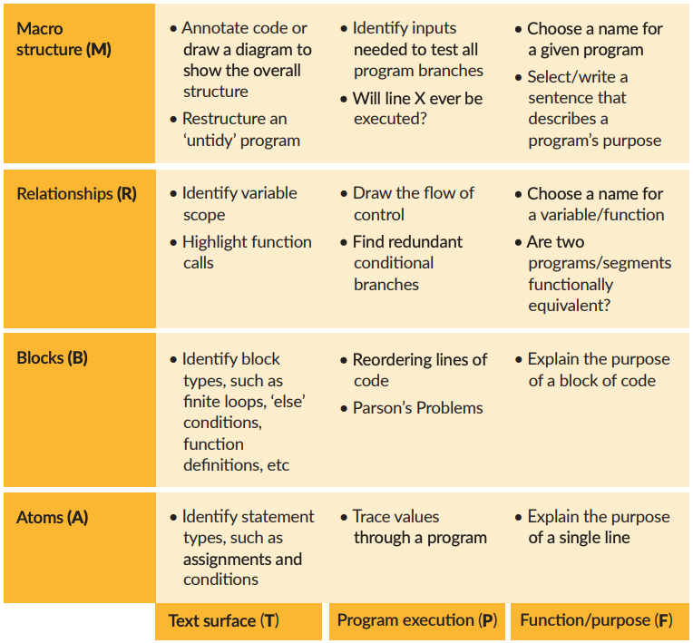

- The [[SOLO Taxonomy]] is good for assessing your overall understanding of programming, but it's helpful to be more detailed when it comes to checking how well you understand a specific file or program. The [**Block Model**](https://helloworld.raspberrypi.org/articles/hw14-the-i-in-primm) breaks down the vague idea of "understanding a program" into specific skills along 2 dimensions:
	- **Zoomed In -> Zoomed Out**: Focusing first on each detail, then build up to a high-level understanding of the entire program:
	  1. *_Atoms_*
	  2. *_Blocks_*
	  3. *_Relationships_*
	  4. *_Macro Structure_*
	- **Depth of Understanding**: Focusing first on the code as a text, then building up to it's purpose in the world:
	  1. *_Text Surface_*
	  2. *_Program Execution_*
	  3. *_Purpose and Context_*
- The image below shows the Block Model in a table with examples of things you can do to check your understanding at each level.
	- 
- Block Model references
	- [Sue Sentance](https://helloworld.raspberrypi.org/articles/hw14-the-i-in-primm)
	- [teachcomputing.org](https://blog.teachcomputing.org/quick-read-understanding-program-comprehension-using-the-block-model/)
	- [Raspberry Pi Quick Read](https://raspberrypi-education.s3-eu-west-1.amazonaws.com/Quick+Reads/Pedagogy+Quick+Read+12+-+Block+Model.pdf)
	- [[Fostering Program Comprehension in Novice Programmers - Learning Activities and Learning Trajectories]]
	- [[Block Model – an Educational Model of Program Comprehension as a Tool for a Scholarly Approach to Teaching]]
-