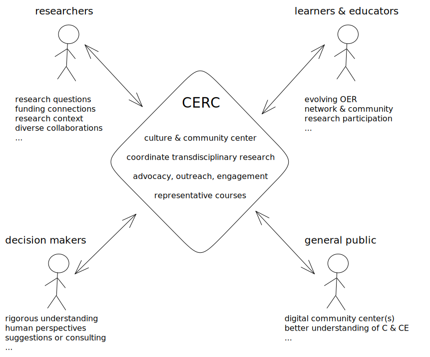

- 
-
- a CER Center:
	- -> believes in plurality of truth and ownership
	- -> conceives of [[CER]] as a [translational transdiscipline]([[Computing Education Research as a Translational Transdiscipline]])
	- is a digital culture and community center
		- transformational progress comes from [[Radical Novelty]]
		- which comes from perspectives you do not already hold -> [[Trading Zones]],
		- so meet, share, learn. all humans, all cultures, all values. especially the challenging ones
	- professionalize & connect CE researchers to ensure identity, recognition & longevity as a field
		- by providing networking & connections for researchers
		- developing the professional & systemic competence to carry out this mission in the long-term through work like https://www.csedgrad.org/
	- maintain & evolve the foundations of CER as a field
		- by carrying out discipline-introspective research
		- by encouraging & supporting development of theory
		- by overseeing methodological development
		- by accepting each contribution for the value they offer
		- by helping develop a "core literature" for initiates
		- by welcoming and supporting new generations of CE researcher
	- promotes quality [[Broader Impact]]s & accountability in CER
		- defined/measure by principles from CRCE & other such theories
		- with outreach to & [participation]([[Participatory CER]]) with  practitioners, learners, industry, policy, et al.
	- Coordinate trans-disciplinary research efforts to develop, improve, promote, and disseminate best practices in CE.
		- by overseeing [[Translational Research Programmes]] defined by targeted Broader Impacts
			- possibly executed with as [[Agile CER]]
		- in partnership with diverse researchers & practitioners
		- by operating and/or supporting [[Representative Course]]s
		- coordinating funding proposals
		- through involvement with open / community projects like [CodeYourFuture](https://codeyourfuture.io/) or [[De Nepo]]
	- engages in advocacy and outreach as appropriate
-
- possible inspirations
	- https://mitili.mit.edu/
	- https://computingeducationresearch.org/
	- https://santafe.edu/ ?