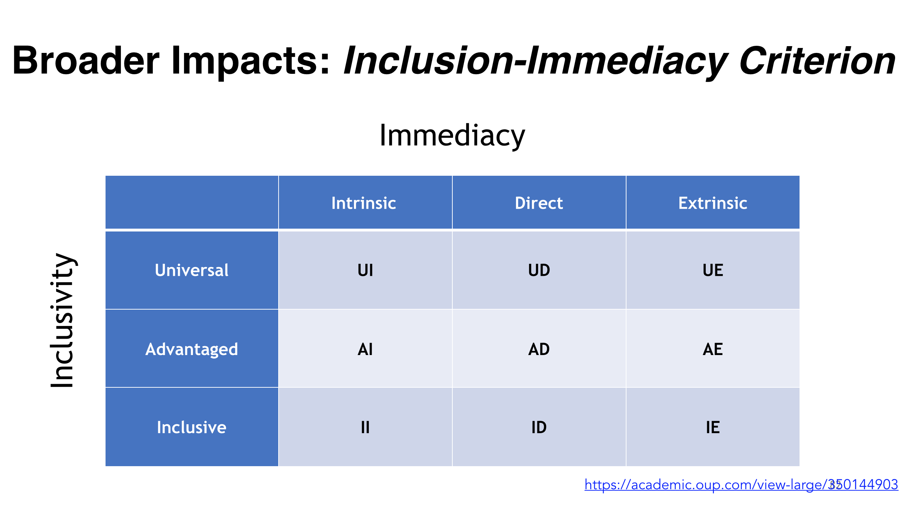

tags:: bibliography

- **Abstract:** Broader impacts (BI) policies generate debate on the purpose of science, measuring the impact of research, and is an important topic for the science policy community. However, BI policies often fail to determine if R&D funding helps marginalized communities. This paper introduces a new framework, the Inclusion-Immediacy Criterion, that assesses who benefits from research impacts as divided into three groups: (1) advantaged groups; (2) the general population; and (3) marginalized groups. The study analyzes National Science Foundation (NSF) project outcome reports and finds that advantaged groups are the most likely to benefit from NSF-funded research. The study also shows that certain areas of NSF research, such as Social, Behavioral, and Economic Sciences, more efficiently generate impacts for marginalized groups compared to other directorates. This paper further argues that persistent inequalities in BIs limit the potential of R&D to increase prosperity and well-being, two of NSF’s mandated goals.
- full paper: , [online](https://academic.oup.com/spp/article/49/2/168/6430224?login=false)
- **Notes:**
	- my take on their table: 
	  id:: 63f8f9c4-8b30-47a7-9710-bfa3f69efcaa
		-
		- their ta
- WOODSON, Thomas; BOUTILIER, Sophia. Impacts for whom? Assessing inequalities in NSF-funded broader impacts using the Inclusion-Immediacy Criterion. *Science and Public Policy*, 2022, 49.2: 168-178.
- ```
  @article{woodson2022impacts,
    title={Impacts for whom? Assessing inequalities in NSF-funded broader impacts using the Inclusion-Immediacy Criterion},
    author={Woodson, Thomas and Boutilier, Sophia},
    journal={Science and Public Policy},
    volume={49},
    number={2},
    pages={168--178},
    year={2022},
    publisher={Oxford University Press UK}
  }
  ```
-