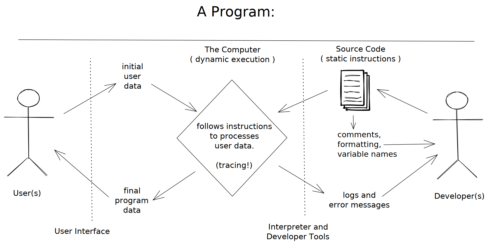

tags:: home,  narrative

- (_This page is adapted from [Welcome to JS/What is Programming](https://github.com/DeNepo/welcome-to-js/tree/master/1-what-is-programming)_)
- ## What is Programming
	- [Programming is communication]([[Rhetorics of Programming]]). It's also a lot of other things, but this introduction will focus on the different ways you communicate with your code when developing applications for end users.
	- When you write code you are really just writing a text document, exactly like you might write an email or a note. The biggest difference between an email and a computer program is *who you are writing for*.
	- When you write an email you're writing for the person who will be reading it. When you write a computer program you are writing for 3 very different audiences at the same time! One single document (your code) needs to be understandable to:
		- **Developers**: A developer needs to read your code and understand what you were trying to do and why.
		- **Computers**: Your code needs to have *perfect* syntax so the computer can parse it, and you must write instructions that are allowed by the programming language or the computer will throw an error.
		- **Users**: The instructions you give to the computer must create an intuitive and pleasant experience for the user.
	- Being a developer means understanding how all these characters interact, and then communicating with everyone involved to deliver quality software within your project's constraints. This diagram shows the different channels of communication in a software project:
		- ((5939fb5c-4688-4ea9-930a-47d7f4a63a52))
-
- ## [[Programming Languages]]
  id:: 6422c88e-33f3-4090-86de-6616f7e23ea2
	- High-level programming languages like JavaScript are a compromise between how people think and how a computer works. Programming languages are not always easy for people to learn but they're definitely easier than directly telling a computer what to do (writing 1's and 0's).
	- Because humans are so much better at learning and understanding than computers are (for now), programming languages have been designed to leave all the hard work for us. It's our job to make sure our instructions for the computer are perfectly structured and do exactly what we want. The computer just _*parses*_ (interprets) our code and follows the instructions without any understanding or thinking.
	- You can think of a programing language as the developer's UI for the computer. Because this UI isn't very intuitive it helps to spend a lot of time studying syntax and other details before writing.
		- This is why it helps to focus on _*understanding*_ programs before writing them? #question [[PRIMM]]
	- [[Learnable Programming]] said it best:
	  id:: 6418f99d-f5f2-4cc2-931e-99a501256afb
		- **Programming is a way of thinking, not a rote skill.** Learning about "for" loops is not learning to program, any more than learning about pencils is learning to draw.
		- **People understand what they can see.** If a programmer cannot see what a program is doing, she can't understand it.
		- Thus, the goals of a programming system should be:
			- to support and encourage powerful ways of thinking
			- to enable programmers to see and understand the execution of their programs
			  id:: 63fe152d-e960-4efb-ba0d-a8a048b6bdc9
		- A live-coding Processing environment addresses neither of these goals. JavaScript and Processing are poorly-designed languages that support weak ways of thinking, and ignore decades of learning about learning. And live coding, as a standalone feature, misses the point.
		- Alan Perlis wrote, *"To understand a program, you must become both the machine and the program."* This view is a mistake, and it is this widespread and virulent mistake that keeps programming a difficult and obscure art. A person is not a machine, and should not be forced to think like one.
		  id:: 63fe1533-0b10-423e-a6ae-0ec0a2e82233
			- _How do we get people to understand programming?_
		- We change programming. We turn it into something that's understandable by people.
	- Until the future when computers & programming are understandable to human thought, we're stuck with programming systems where we do the hard work of understand computers.
	- ### Static vs. Dynamic
		- ... #todo
-
- ## What is a Program?
  id:: 6401c5cc-ef60-40d6-b377-b153675ee767
	- The rest of this narrative will take a closer look at each part of this diagram:
	- 
	  id:: 6422c66f-1ac0-4e6d-a8c0-e9e8a719445c
	- ### The Programming Language
		- Your source code, written with a programming language, is represented by the pages in this diagram.
		- A programming language has some features that help *developers understand* the code, some features that *instruct the computer*, and other features meant to *interact with the user*.
		- Let's take a closer look at these features and their place in the diagram.
	- ### Developers
		- (_developers are on the far right of this diagram_)
		- Developers are involved with designing the software, writing the code, and fixing the bugs. As a developer you'll spend lots of time reading source code. So it's very important to make sure your code is easy to understand by others, and by yourself in the future.
		- You should think first of other developers who will need to understand your program, and second of yourself. Why is this more productive? First because working on a team is easier when everyone is looking out for each other. Second because one day you'll be someone else! After even half an hour your thoughts about a program are no longer fresh, you'll need to rely on what you wrote to figure out the details of your own program.
		- **Language Features For Developers**
			- **Static language features**: Comments, variable names and code formatting help developers read and understand source code.
			- **Dynamic language features**: Logs and error messages help developers understand what is happening inside the computer as it follows the code's instructions.
			- ((6422c66f-1ac0-4e6d-a8c0-e9e8a719445c))
	- ### Computers
		- (_computers are in the center of this diagram_)
		- You've been the user of many websites, you've even developed a few with HTML & CSS, but you haven't had to *be the computer* yet. With HTML & CSS it's enough to learn what goes in and what comes out, you don't need to know what happens in between:
			- _HTML/CSS goes into a browser -> ... ? ... -> a website is displayed_
		- With JavaScript it's the complete opposite. What the program *does* (inputs -> outputs) is less important than *how it happens*. Your goal now isn't to amaze the user, it's to become the computer and understand what happens between the input and the output:
			- _source code -> **a lot of important steps** -> final output_
		- #### Computer Empathy
			- A program is just a series of instructions. If you follow the instructions *exactly* like the computer would, you are actually running the program by hand! (just a lot slower.) There is no difference in theory between you following the code's instructions and a computer following the same instructions.
			- So when you practice tracing think of it as building your *computer empathy*: understanding what it's like to be the computer as it runs your program. If the first rule in design is "know your user", then one of the first rule in coding should be "know your computer". After all, the computer is one of your code's users!
		- #### Predict, not Explain
			- So what does it mean to "know" a programming language? How do you know when you've understood how the computer reads your code? When you can **predict** *exactly* what will happen at each step of execution!
			- Explaining a program in plain english is helpful but it's easy to be a little bit wrong and not know it. When you focus on *predicting* what happens at each step and you check your predictions with a trace or memory visualization tool, then you really know if you understood.
			- This approach is also helpful because not only will you know if you're right, but if you're wrong the computer will tell you the right answer! Then you know exactly which line you didn't understand, and you know what to study next.
		- #### Language Features for Computers
			- The computer is in the center of this diagram. It interpreting the developers source code, processing the user's data, and logging information for the developer:
			- ((6422c66f-1ac0-4e6d-a8c0-e9e8a719445c))
	- ### The User
		- (_users are on the far left of this diagram_)
		- Users will interact with your running programs, but will never see your source code. When writing for a user you need to think of their needs and their experience using your program.
		- For now the user experience of your programs will be limited to pop-up boxes, but that doesn't mean you can't think of UX (User Experience). A user always appreciates clear instructions at the right moment, helpful feedback and a friendly tone in your messages.
		- How does thinking of a user help you write code that they will never see? It's about keeping the big picture in mind and making priorities. It's easy to get caught up in the details of your code, taking a step back to remember who you're developing for and why they need this program keeps your priorities in perspective.
		- #### Language Features for Interacting with Users
			- **Inputting Data**: `prompt` is a simple way for users to input data to a JavaScript program.
			- **Outputting Data**: `alert` is a simple way for the computer to display data to a user.
			- ((6422c66f-1ac0-4e6d-a8c0-e9e8a719445c))
	- ### Data In / Data Out
		- The basic job of a computer program is to process data. Even the most beautiful and interactive programs are processing data behind the scenes. One of the biggest tricks to programming is figuring out how to *model* your problem using data so computer can help you solve the problem.
		- The programs you'll be studying in this module are focused on processing *text data* (yup, no math :). This is a good place to start because you are already used to reading and working with text so it shouldn't be too hard to understand what's happening inside the computer:
			- 1. The user inputs some text data into a pop-up.
			  2. The program processes the data. (*tracing*!)
			  3. Some new data is displayed to the user in a pop-up.
		- Later on you'll learn how to make better user interfaces than just a pop-up, but the main idea will remain the same: The user interface is a human-friendly way for the user to interact with your program, the actual program is running behind the scenes processing their data and producing new data.
		- #### Language Features for Processing Data
			- #stub
			- **Data Types**
			- **Operators**
			- **Data Structures**
	- ### Understanding Programs
		- A very important skill to learn as a programmer is not being afraid of code you don't understand. There is always *something* you can understand and there is always a way to understand the rest. You aren't expected understand all the syntax in every program you read.
		- Instead focus on what you *can* understand about each program at a higher level, like in the diagram at the top of this README.
		- For example, try running the program many times inputting different data and seeing what comes out. Practice explaining what is happening in a program using these terms:
			- **Program Behavior**: You can answer these questions just by comparing inputs and outputs! You don't need to read a single line of code:
				- What does the program do?
				- What happens to the user data, how is it transformed by the program?
			- **Data In**: What data does the program expect? Try to say this in a normal human sentence.
			- **Data Out**: What data does the program expect? Try to say this in a normal human sentence.
			- **Test Cases**: Specific examples of data that goes in and the data that comes out.
	-
-