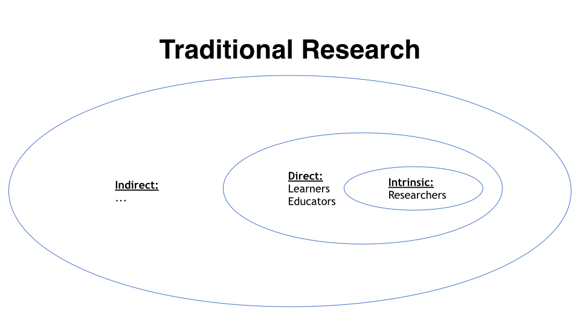
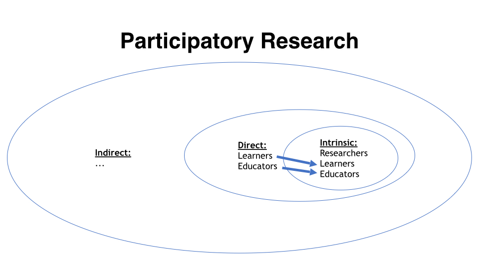

- "with" not "for"
- I wonder about [[Participatory CER]] (PCER)
  id:: 63f75350-4779-410a-b9f0-168cab1faf2a
	- How do educators and learners retain ownership of their education while partnering with researchers? #question
	- How to avoid extraction dynamics in a research-practice partnership? #question
	- How to balance the [[Speed of Trust]] with the [[Speed of Funding]]? #question
	- How do researchers maintain intellectual independence and integrity when partnering with practitioner partners? #question
	- How to balance rigor & speed to best help learners? #question
	- How to balance the interests of current vs. future learners when conducting “real-time” experiments? #question
	- What is the relation between [[Participatory CER]] and [[Culturally Responsive Computing Education]]? #question
	- How do theory and PCER interact? #question [nelson '18]([[On Use of Theory in Computing Education Research]]) [malmi '19]([[Reflections on Theory]]) [tenenberg '22]([[Conceptualizing the Researcher-Theory Relation]])   [tedre '22]([[Grand Theories or Design Guidelines? Perspectives on the role of theory in Computing Education Research]])
- My simplified, evolving understanding of [[Participatory CER]]
	- Stakeholders in CER, who are these people? They can be anyone studying or teaching programming, at school, at home, with friends.  Stakeholders can also be organizations: non-profits, universities, unemployment services.  And stakeholders can also be anyone indirectly impacted by CE, employers or family members
	- So rather than listing all the different stakeholders of a TRP, I instead think about their relationship to the research process & the final designed artifacts.  These three categories of stakeholder are inspired by the [Inclusion-Immediacy Criterion]([[Impacts for whom? Assessing inequalities in NSF-funded broader impacts using the Inclusion-Immediacy Criterion]]):
		- **Intrinsic Stakeholders**: anyone with decision power as to how the research is conducted
		  id:: 63f9dca1-560c-458a-b8ad-66c50bc61452
		- **Direct Stakeholders**: anyone who will directly benefit from the research artifacts
		  id:: 63f9dca5-4a3f-4028-862e-18eb69525f8c
		- **Indirect Stakeholders**: anyone who stands to benefit indirectly from "trickle-down" effects of the research
	- In "traditional" research you might classify Researchers as [Intrinsic Stakeholders](((63f9dca1-560c-458a-b8ad-66c50bc61452))), and consider Learners and Educators to be [Direct Stakeholders](((63f9dca5-4a3f-4028-862e-18eb69525f8c))) – standing to benefit directly from the research program. This, however, implies that the learners and educators involved in your research are merely objects of study – a representative sample.  Considering [TCER's]([[Computing Education Research as a Translational Transdiscipline]]) emphasis on Outreach and Engagement, this is a problematic way to approach TRPs"
		- 
	- In contrast stands Participatory Research. A very simplistic way I understand Participatory Research is to reconsider the representative sample of Learners and Educators' role in the research process, “upgrading” them from objects of study to [intrinsic](((63f9dca1-560c-458a-b8ad-66c50bc61452))) research collaborators who help to select research questions and steer the TRP.
		- 
-
	-
	-
- participatory research methodologies
	- [[Participatory Action Research]]
	- [[Agile CER]]
	- [[Translational Sprints]]
- related
	- [[Research-Practice Partnership]]
	- [[Trading Zones]]
	- Medicine has some done some solid thinking on participatory research
		- [[Engagement Rubric]] from [PCORI]([[Patient-Centered Outcomes Research Institute]])
	-
	-