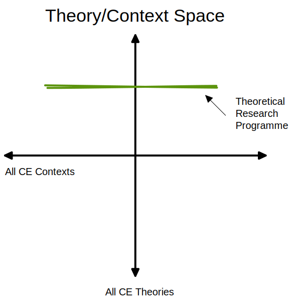

alias:: Theoretical Research Programmes

-
- the inverse of [[Research Programmes/Translational]], [[Research Programmes/Theoretical]] aim to build our abstract understanding of [[CER]] by exploring a narrow set of theoretical constructs across a variety of contexts:
  title:: Research Programmes/Theoretical
	- 