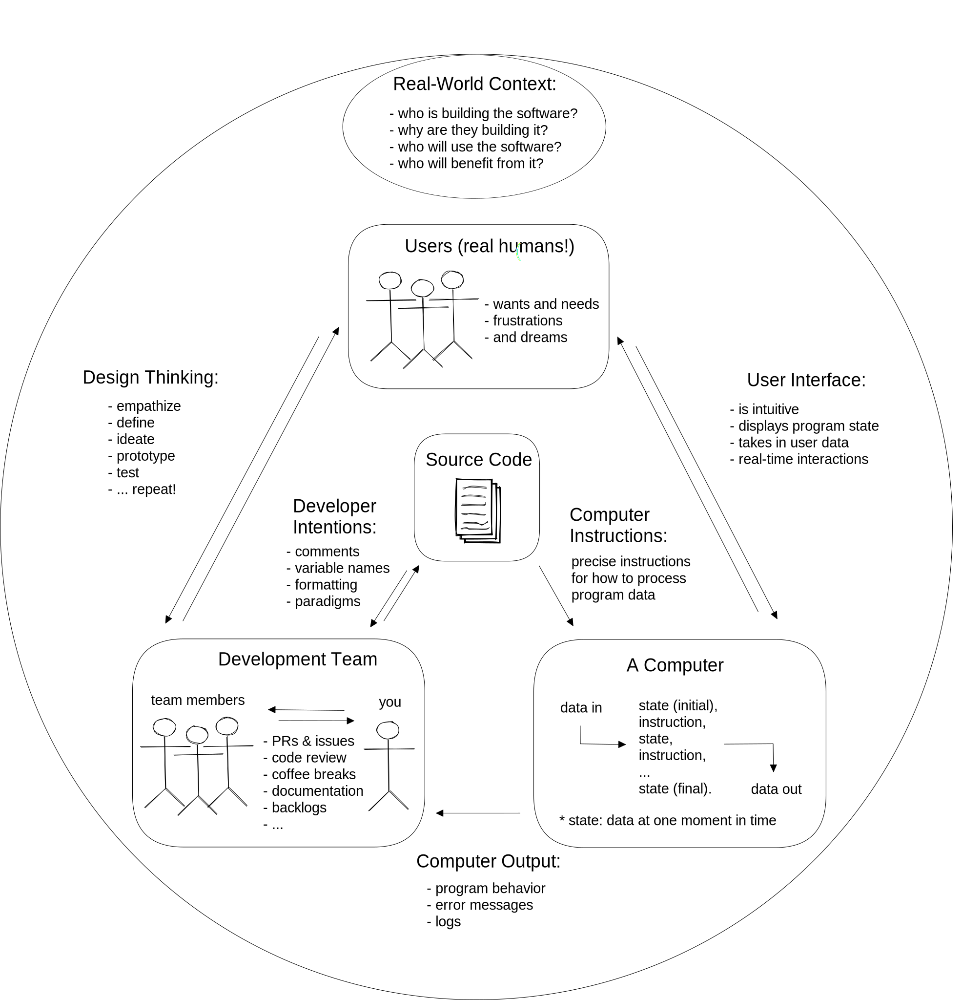

-
- [[Spiderweb Curriculum]]
-
- ## Web Development
	- (make, then link to DeNepo template repo)
	- Programming is communication. It's also a lot of other things, but this curriculum will focus on the different ways you communicate with your code.
	  When you write code you are really just writing a text document, exactly like you might write an email or a note. The biggest difference between an email and a computer program is ***who you are writing for***.
	  When you write an email you're writing for the person who will be reading it. When you write a computer program you are writing for 3 very different audiences at the same time! One single document (your code) needs to be understandable to:
		- **Developers**: A developer needs to read your code and understand what you were trying to do and why.
		- **Computers**: Your code needs to have *_perfect_* syntax so the computer can parse it, and you must write instructions that are allowed by the programming language or the computer will throw an error.
		- **Users**: The instructions you give to the computer must create an intuitive and pleasant experience for the user.
	- Being a developer means understanding how all these characters interact, then communicating with everyone involved to deliver quality software within your project's constraints. This diagram shows the different channels of communication in a software project:
	- 
- ## Data Science
	- (link to ReACT template repo)
	- The group projects you will work on will help you understand investigative data science projects from beginning to end. The main focus is collaboration, project planning/scoping, and communicating your results effectively.
	- You should keep the technical aspects of your project as simple as possible so you can finish your projects on schedule, and so you are free to focus on _the big picture_:
	- 
- developers vs. programmers:
	- https://computinged.wordpress.com/2012/05/21/we-need-to-produce-far-more-software-developers-than-programmers-how-do-we-change/
- [[Full Complexity, Max Simplicity]]