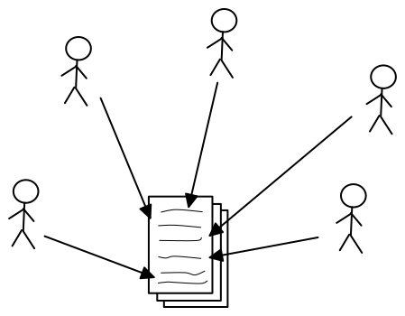
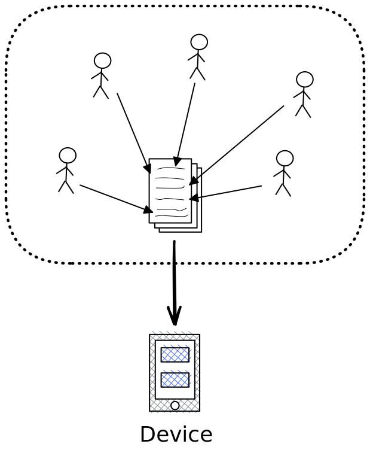

- [[Rhetorics-First Introductory Sequence]] , [[Spiderweb Curriculum]]
- [[Full Complexity, Max Simplicity]], [[Whole Game]], [[Spiderweb Curriculum]]
- i wonder about the [[Rhetorics of Programming]]
	- how can you define useful [[Rhetorical Situation]]s for different types of programming? #question
	- can [[Rhetorics of Programming]] & the [[Spiderweb Curriculum]] provide the basis for methodically integrating ethics with introductory programming?  #question
	  id:: 3407d0a0-b397-4f51-a74a-a40ea466a0d8
		- My experience says yes, and that introducing [[Design Thinking]] early on is part of this
		  id:: 6401c5cc-7100-499e-8ad2-3000911103c9
		- [[Integrating Ethics into Introductory Programming Classes]]
	- what if [[Rhetorical Situation]]s, not learning objectives, were the first step of curriculum and certification design? #question [[Rhetorics-First Introductory Sequence]]
	  id:: 6401c5cc-2dd2-48e4-99cc-3741ef1a0e96
		- the progression of courses/modules could add layers and complexity to the RS
		- the constraints placed by the RS would help define learning objectives -> [[Spiderweb Curriculum]]
		- can this address issues with over-engineered learning objectives? (#todo dig into [[CSK8]] episode references)
		  id:: 640b8af2-6ad7-443f-b60e-ec4477a4ecd5
	- [[A Mathematician's Lament]] -> A Programmer's Lament? #question
		- How does teaching "computational thinking" fit into this? and [[Notional Machine]]s? and [[Rhetorics-First Introductory Sequence]]?
- [[Rhetorical Code Studies]]
-
- some diagrams that focus narrowly on the text and the no/computer
	- **Collaborative Writing**
	  id:: 647618a3-f9e5-40c2-8065-b8108df6ee49
		- 
	- **Collaborative Development**
	  id:: 647618a8-dcc3-4625-9140-9e44e10a1959
		- {:height 765, :width 619}
-
-
- developers vs. programmers:
	- https://computinged.wordpress.com/2012/05/21/we-need-to-produce-far-more-software-developers-than-programmers-how-do-we-change/
	  id:: 640b8af2-0fd2-4ea1-9aa4-0738d2806c64