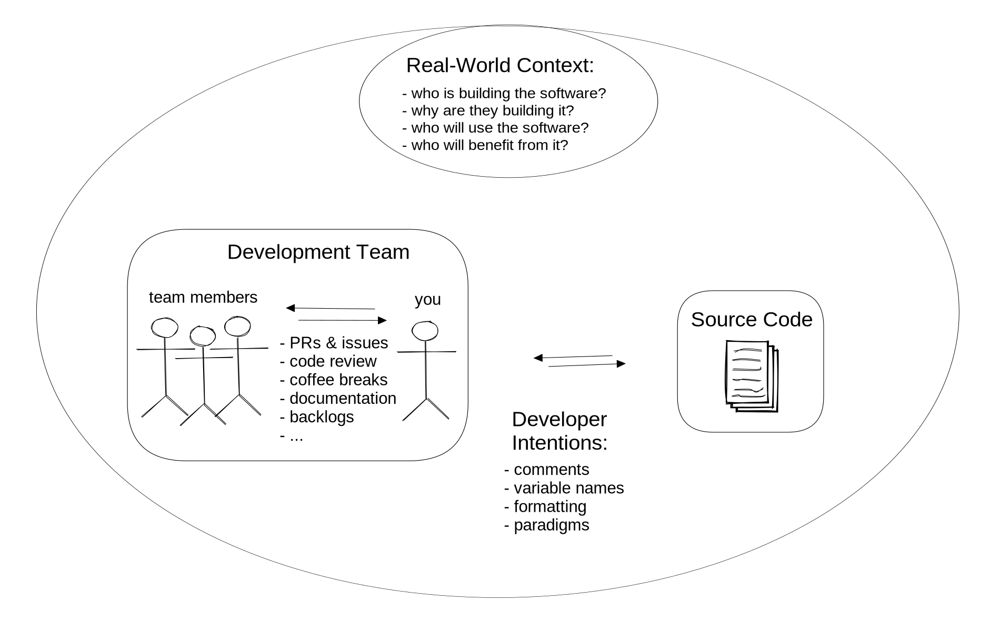

tags:: narrative
audience:: tbd
id:: 6401bcd3-ec4a-465c-9574-3591c7a12757

- we need to #unask what programming languages or paradigms to teach first, and instead ask "how do we teach _how_ and _why_ programming happens?".
	- how do groups of people fund, develop, deploy and use software to create meaning and shape society?
	- teaching the details of programming can follow naturally after setting this context.
	- programming is the creation of meaning through collaborative writing, where the text must also be executable.
	- _**note**: this is not the same as [[Rhetorical Code Studies]]! I am suggesting to use Rhetorics as a framing mechanism for introductions to programming. I am not suggesting to replace introductory programming with deep-dive rhetorical analysis of software development._
	-
- [What is programming anyway?]([[Module/Welcome to JS/1. What Is Programming]])
-
- Computing education's ["first"](((63f60cad-216a-41dd-9343-53e4640ebb3a))) could be the [[Rhetorics of Programming]], with different [[Rhetorical Situation]]s defined for different learning paths.
- these Rhetorical Situations could be layered into a [[Spiderweb Curriculum]].  i can imagine learning paths being described as a [[Knowledge Graph]] of rhetorical situations, where learners get to specialize not by deciding _what_ languages or technologies to learn but by deciding _where_ and _how_ they'd like to apply what they learn.
	- this approach could make it easier to approach the "CS0"/"programming for non-majors"/"programming in X discipline" question by providing one introductory class that sets the stage for a wide variety of paths: CS, software development, [[Conversational Programmers]], ...
	- [[Integrating Ethics into Introductory Programming Classes]] becomes natural, a Rhetorical Situation prioritizes bigger questions over technical details
- i wonder about [[Rhetorics-First Introductory Sequence]]
	- is [[PRISMM]] just another pretty acronym, or could it be a useful starting point for Rhetorical curriculum design? #question
	- are [[Large Language Models]] a boon to rhetorics-first teaching?  Rhetorics-First is [[PRISMM]]-heavy, so educators won't need to manually create all examples. and the issues surrounding LLM and other code generators (security, IP, efficiency, ...) all make great talking points.   #question
	  id:: 640a4775-f253-4bb0-926e-d0e8a903e252
		- not just the code that it generates, but also the chat bots? and refining code through chat?
	- is Rhetorics-First a "future-proof" strategy in computing education? #question
		- Even if programming as we know it is replaced with operating code generators, the [[Rhetorics of Programming]] would only be more approachable and immediate for learners as software development became more accessible.
		- ((640b1be7-2cfc-402c-a9fd-92b8f0fb1c0b))
	- Could Rhetorics-first be effective for [[Agile Continuous Education]]? #question
		- different careers and positions will have different rhetorical situations
		- ACE expects that you will not learn everything in class but will do lots of on-the-job training.
		- by defining ACE courses with a rhetorical situation you can spend (relatively) little time in the classroom preparing learners to integrate quickly on the job, where they could do most of their technical learning
		  id:: 640a4abb-d665-4571-a09f-0f7e5a71fa1a
	- would a rhetorics-first introductory sequence count as a transdisciplinary merging of ethics and computing? -> [[Integrating Ethics into Computer Science Education: Multi-, Inter-, and Transdisciplinary Approaches]] #question
	  id:: 641906bb-6313-4add-91b1-3ba237fd4d30
		- ((641922cc-5219-446c-971b-809e642874e6)) ...
	- what could be adapted from literary education to help learners understand programs in a R-F curriculum? ie. text analysis strategies, critical lenses, ... #question
		- [[Study Lenses/Ask Me]]
	- would focusing on the [[Rhetorics of Programming]] productively "fill" time in the curriculum so that technical learning objectives can be spaced out to a [learnable density]([[Learning to Program is Easy]])? #question
	- ((640b8433-cca8-4ce8-8904-b720aebaa0b6))
	- could R-F be helpful in [decolonizing CE]([[Decolonising Computer Science Education: A Global Perspective]])? #question
	  id:: 640caaf3-ca94-4701-97b0-e54a356162bc
- below is one possible introductory sequence designed around snowballing rhetorical situations instead of technical objectives
	- **note**: I have been teaching this way for the last few years. Not always overtly but it has informed how i set expectations for learners, sequence learning objectives, and design projects.
		- The course i helped run began with collaboration skills around markdown files, then project management with simple HTML/CSS projects, then Design Thinking and User Empathy (still with only HTML/CSS).  Only after 2 months of this did we move on to JS.
		- feedback and results have been good.  the strongest encouragement i get is from the many learners who say they found their place in software development as designers or project coordination, even if the JS programming never clicked for them. i don't believe this would be possible with a more conventional programming-first approach
		- [[Full Complexity, Max Simplicity]], [[Whole Game]], [[Process Over Product]]
	- **Big Picture 1**: *multiple humans collaborating on one body of text*.
		- Objectives: IDE, git/hub, task management, collaboration, "code" review, ethics, ...
		- this course has been prototyped using only Markdown which is simple enough to not distract - [[Module/Workflows]]
		- 
	- **Big Picture 2**: *then multiple humans collaborating on a text that a computer must also interpret*.
		- this could be covered with HTML & CSS because it's motivating, static pages easily go public, there is no heavy [[Notional Machine]] for markup languages.
		- Objectives: task decomposition, code quality, development methodologies, project constraints, ...
		- a possible bonus to starting this way is the (relative) domain-independence of building a static web page.  learners can [bring their own culture]([[Culturally Responsive Computing: a theory revisited]]) to the projects.
		- emphasizing [[Process Over Product]] would additionally free learners to choose the _topic_ of their projects without evading the primary [[Learning Objectives]]
		- prototype curriculum - [[Module/Agile Development]]
		- 
	- after these two modules, learners would be able to choose different paths.  Two possible paths include (but are not limited to!):
		- **Software Development**: --> [[Rhetorics of Programming/Apps]]
			- **SD 1**: *multiple humans developing software to reach other humans*.
				- Objectives: design thinking, user empathy, accessibility, ...
				- this course has been prototyped using HTML, CSS and CSS libraries - [[Module/UX-UI Design]]
				- 
				  id:: 6409e35e-6d4e-4263-81f7-69768f2cf294
			- **SD 2**: *SD1 + event and data processing*
				- Objectives: code splitting, testing, CI/CD, [event-driven programming]([[Event-driven Programming in Programming Education: A Mapping Review]]), ...
				- ((5939fb5c-4688-4ea9-930a-47d7f4a63a52))
		- **Data Science** --> [[Rhetorics of Programming/Data Science]]
			- **DS 1**: *how humans can use computers to interrogate and understand data*
				- Objectives: basics of programming, questioning data quality, ...
				- 
			- **DS 2**: *how humans can use computers & data to interrogate, understand and change the world*
				- Objectives:  data collection techniques & strategies, data modeling, ethics of data science & data modeling,  ...
				- a prototype of this curriculum --> [[ReACT Digital Projects 2022]]
				- ((f62ef9ac-c1b9-4927-b7c7-46802718eea5))
		-
			-