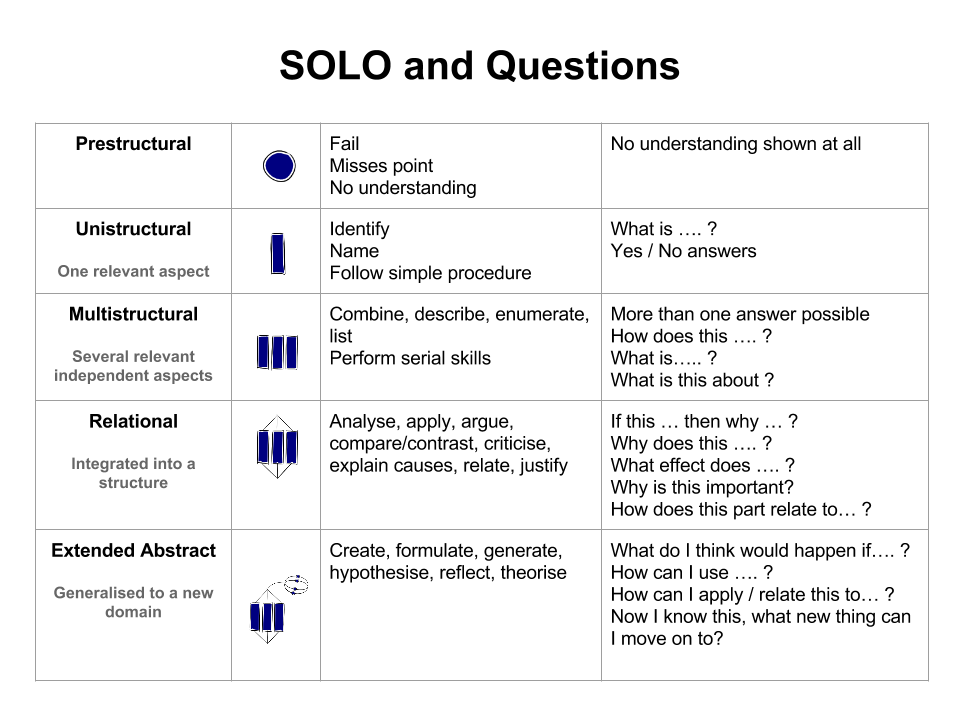

- Programming is complicated, there are many concepts to learn and all of the concepts are related in different ways. This means you actually have two kinds of knowledge to build:
	- **Concepts**: The individual concepts of programming, things like *_variables_* and *_APIs_* and *_repositories_*. Studying each of these concepts separately will be important before moving on to ...
	- **Connections**: How the individual concepts are related, each relationship is a new thing to learn! For example once you understand variables and arrays separately, you will still need to study *_reference vs. value_* (how *_variables_* store *_arrays_* in memory).
- **Self-Assessment**: A helpful way to assess your own understanding is to use the *_SOLO Taxonomy_*. From top to bottom, each row in the table below represents the next step in your learning. The first levels of the SOLO Taxonomy (*_Prestructural_*, *_Unistructural_*, *_Multistructural_*) are about understanding **concepts**. The last levels (*_Relational_*, *_Extended Abstract_*) are about understanding and
  mastering **connections**.
- {:height 590, :width 776} - [Stuff and Nonsense](https://bobthedog3.blogspot.com/2015/11/using-solo-taxonomy-to-help-to.html)
- Solo Taxonomy & self-assessment References
	- [Great intro video](https://www.youtube.com/watch?v=_ZoIPXJ8XRQ)
	- [Intro: Future Learn](https://www.futurelearn.com/courses/learning-teaching-university/0/steps/26410)
	- [Intro: Hooked on Thinking](http://www.pamhook.com/mediawiki/images/b/b2/SOLO_Taxonomy%2C_Scratch_and_Angles_in_Geometry.pdf)
	- [Self-assessment template](http://pamhook.com/mediawiki/images/e/ee/SOLO_Functioning_Knowledge_Rubric_Template.pdf)
	- [Example self-assessment for loops](http://pamhook.com/mediawiki/images/1/10/HookED_Writing_Code_Rubric.pdf)
	- [University of Queensland](https://itali.uq.edu.au/teaching-guidance/principles-learning/guiding-theories-and-frameworks/structuring-learning)
- Bibliography:
	- [Lister et al. 2006]([[Not Seeing the Forest for the Trees: Novice Programmers and the SOLO Taxonomy]])