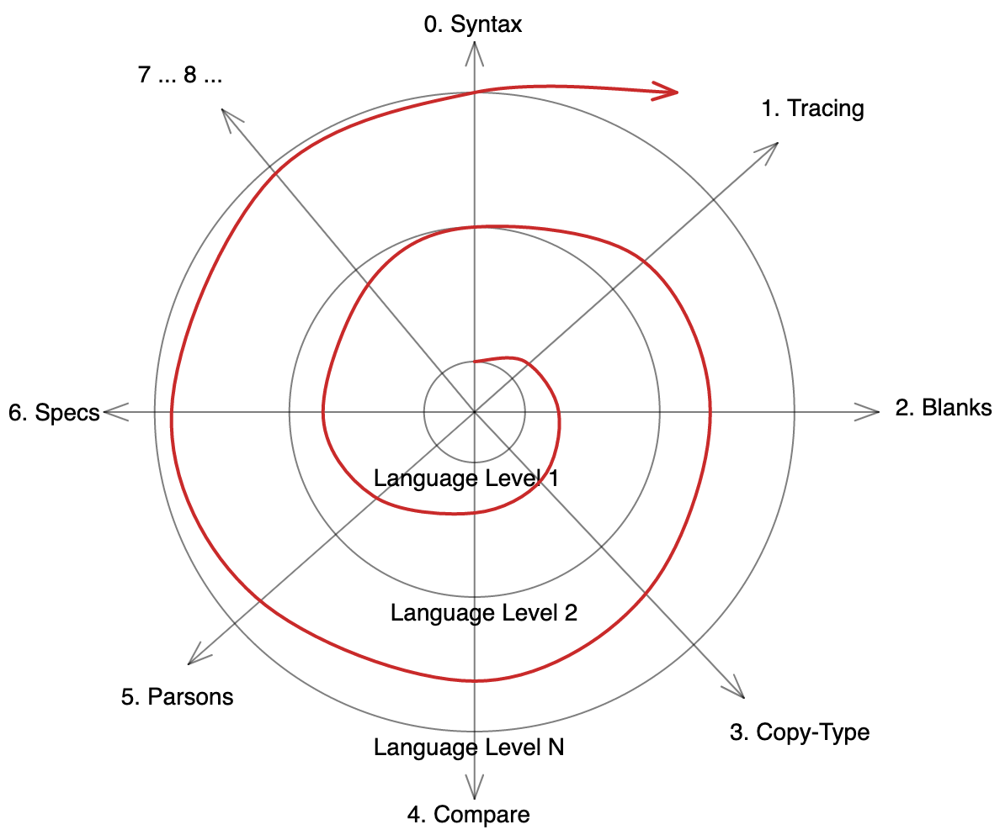

tags:: design

- i see the [[Spiral Curriculum]] as a special case of the [[Spiderweb Curriculum]]
	- the rings of the web represents a progression of [[Language Level]]s.  The progression of language levels can be defined by [[Task Class]]es, though several language levels may fit within the same task class. Language features covered in each ring (language level) are defined by a minimal subset of features required to build projects in this task class. A separate [[Notional Machine]] can be defined for each language level to help teaching and learning
	- each spoke of the spiral represents a progression of skills inspired by the [[Block Model]], [[SOLO Taxonomy]], [[PRIMM]], feedback + experience, ...
	- the curriculum (and so the learner's path) spirals outwards, rehearsing each skill in progressively larger language levels
	- an example spiral curriculum diagram: {:height 632, :width 747}
- the role of [[Study Lenses]] in implementing a spiral curriculum
	- makes content authorship more efficient
	- supports learners as they explore many learning objectives with a small amount of code
	- enables the curriculum designer to guide learners through specific skill sequences while traversing the spiral
- Proofs of Concept:
	- [live demo](https://study-lenses-demo.onrender.com/spiral-curriculum?--defaults)
	- [Just Enough JavaScript]([[Module/Welcome to JS/Just Enough JavaScript]])
		- actual chapters
		  collapsed:: true
			- 0. errors
			  1. comments and logs
			  2. primitive values
			  3. operators
			  4. booleans
			  5. strings
			  6. undefined
			  7. variables
			  8. null
			  9. interactions
			  10. numbers
			  11. block scope
			  12. conditionals
			  13. while loops
			  14. review quiz
			  15. for of loops
			  16. break
			  17. continue
		- task class:
		  collapsed:: true
			- 0-6: programs that evaluate expressions and log values, using a limited subset of operators and types
			- 7-8: ^ + storing and using values in memory with variables (`let` only)
			- 9-10: ^ + linear user I/O with both of these approaches:
				- `prompt`/`alert`/`confirm`: simpler but less engaging exercises that are supported by study lenses. do not include numbers so as to avoid covering coercion
				- [[DOM IO Library]]: more interactive programs with an abstraction to use numbers without exposing coercion. exercises have HTML, CSS & JS. must be completed using "authentic" development and debugging workflows
			- 11-14: ^ + control flow (`if`/`else`/`else if` and `while`), plus input validation strategies based on I/O loops with `while`
			- 15: ^ + iteration using `for of` loops (not `for` loops!)
			- 16-17: ^ + advanced iteration using `break` & `continue`
		- Spokes of the web (roughly, not all chapters cover each skill as appropriate)
		  collapsed:: true
			- this progression of skills inspired by discussions with learners and the [[Block Model]], [[SOLO Taxonomy]], [[PRIMM]], the advice and work of [Felienne Hermans](http://felienne.com/), ... but is not methodologically sound.
			- 0. **Syntax**: Learn to identify and mark different features of syntax. 
			  1. **Trace**: Trace tiny programs using trace tables and check your work with a variety of visualization tools.  Static & dynamic study support is provided.
			  2. **Read**: Read & annotate small programs, answering pre-written & generated comprehension questions.  Static study support is provided.
			  3. **Blanks**:  Fill in blanks in a tiny program.  Blanks are generated according to the learner's difficulty options, and their work can be checked using a diff editor. Static study support is provided.
			  4. **Quiz**: A variety of multiple choice questions with formative feedback available for each possible answer.  Currently hand-written, but could be generated automatically.  Only trace tables are provided.
			  5. **Copy-Type**: Practice remembering and reproducing the code from tiny programs, can be studied individually or with peer(s).  Work is checked using a diff editor.  Only generated comprehension questions are provided.
			  6. **Translate**: Given a small program written in pseudo code, document it and translate it to functioning JS code.  No automatic feedback is provided (yet). Static and dynamic study support is provided.
			  7. **Compare**: Given tiny and similar programs, determine if they have the same behavior without running them.  The answer and an explanation are available to learners.  Only trace tables are provided.
			  8. **Parsons**: Reconstruct tiny programs with distractors, hints and automated feedback.  Learners have dynamic and static analysis options available for their constructed programs.
			  9. **Logs**: Learners must write as many programs as possible that log a pre-defined series of values. Static and dynamic study are provided.
			  10. **Specs**: Given a program's title, behavior and test cases, write passing code using `prompt`/`alert`/`confirm` for I/O.  Exercises have various amounts of scaffolding including labeled goals and template code.  A code review checklist is provided along with static and dynamic study support.
			  11. **DOM I/O**: Given a user interface (HTML+CSS) and real-time expected outputs, write code with the same behavior.   Exercises have various amounts of scaffolding including labeled goals and template code.  No code review checklist or study support are provided beyond what's available in an IDE + browser.
			-
			-
- **Citations**:
	- the term "spiral curriculum": [nelson '21]([[Teaching and Assessing Programming Language Tracing]]), [Xie et al. '19]([[A Theory of Instruction for Introductory Programming Skills]]), [schneiderman, '77]([[Teaching Programming: A Spiral Approach to Syntax and Semantics]])
-
-