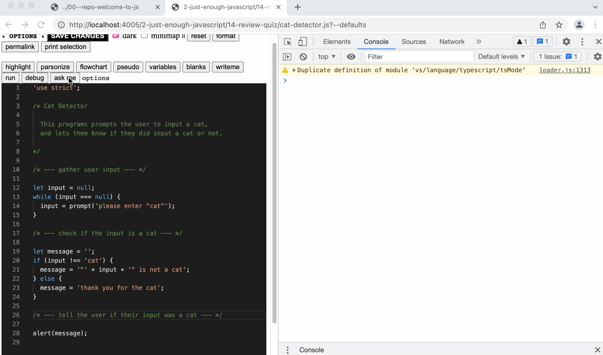

- this button generates comprehension questions about the learner's code.
	- generated questions are (mostly) open-ended for reflection or discussion. answers are only provided to a few basic questions about program execution (thanks to [qlcjs](https://github.com/teemulehtinen/qlcjs)).
		- generating answers to less trivial comprehension questions is an interesting research #question
	- configuration options are inspired by the [[Block Model]], [[SOLO Taxonomy]] and [[Spiral Curriculum]].  learners can select the language features they want to study, and the taxonomy levels they want to practice
- generating questions for a small program
	- 
- a fun social history of Ask Me
	- the original inspiration was [[Let's Ask Students About Their Programs, Automatically]]
	- but I wanted to find a light-weight approach that supports open-ended study of any code, and makes no extra work for content creators.
	- to create the questions I looked for inspiration also outside of programming -> discussion questions used in literature education
		- side #question: Is code more like prose or poetry?  hypothesis: more like poetry because allusion & metaphor aren't far from abstraction.  could maybe look for overlapping ((63fb32c5-7312-4611-ba66-b4bc69296bc8)) of code & poetry vs. code & prose?
	- Teemu, the author of [Let's Ask ...]([[Let's Ask Students About Their Programs, Automatically]]), and I had a nice call. The Ask Me button inspired him to create [qlcjs](https://github.com/teemulehtinen/qlcjs). (Hello Teemu!)
	- [qlcjs](https://github.com/teemulehtinen/qlcjs) inspired me to integrate their multiple choice questions into the Ask Me button
	- Teemu published [[Automated Questionnaires About Students' JavaScript Programs: Towards Gauging Novice Programming Processes]] which investigates using [qlcjs](https://github.com/teemulehtinen/qlcjs) embedded in a MOOC
- i wonder about [[Study Lenses/Ask Me]]
	- what aspects of teaching does this automate? and is this automation actually helpful? #question
		- a lot of teaching 1-1 is asking learners questions about their code, this work is automated with Ask Me.  i believe this serves many purposes, the one that interests me most for this question is ...
	- are learners building a repertoire of useful questions they can ask themselves later? if so, do they actually do this on their own without the button? if so, does it help? #question
		-