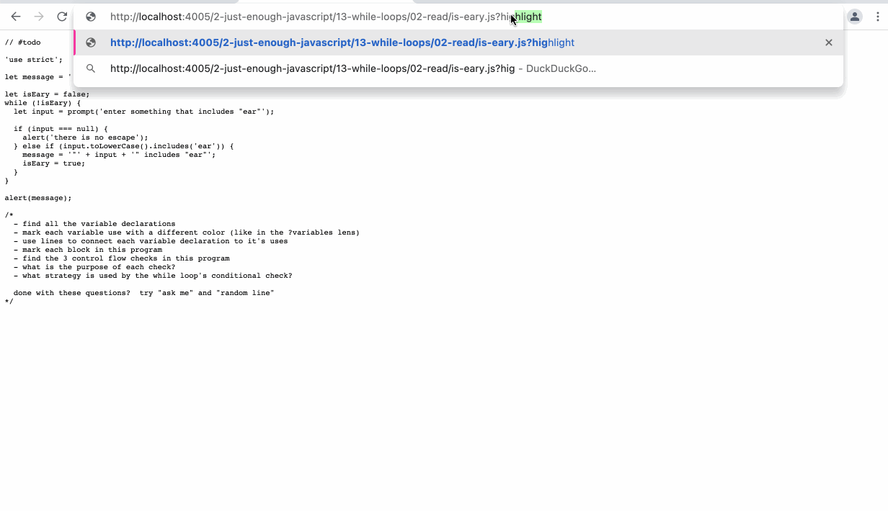

- highlights the code an enables annotation
	- can select a random line for discussion
- 
- would be cool to integrate some features from [this code annotation tool](https://annotate.codereading.club/#/file/CIUwciAOD2D0DuIA2BjaBbEBaALtLAVgM6wBGS0psATCCAAwAsAJowGz0CcAHAGZ8oUAVmbUUbAIZCJvakKacAjAGYQvAOxtqzEG1jKsAVwB2OgE5EcE0wEtjAcyyQz0e2YnoS1LGZATmdo7Oru6esCAAHiBmKDZEICS+kH44WNBmPiDo0ABuIAB0xEA)