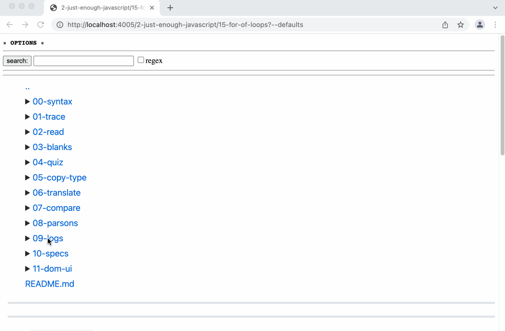

- challenges learners to write as many programs as possible which log the correct values in the correct order.
	- feedback is given in the console showing the expected values and giving feedback on the actual logged values, either with a message if there were too few/many or an assertion library if an incorrect value was logged
- the exercise is authored and stored as a folder of code with these items:
	- `/expected-logs.js` (required) -> exports an array of arrays.  the top-level array represents each console log, the nested arrays represent the expected values of each log.  You can expect learners to log more than one value per log (eg. `console.log('age', 1);`)
	- `/solutions/a-starter.js` -> different solutions to the same challenge.  the content author can seed this folder with starter code, and learners also create new files in this folder when they create a new solution from the UI
	- `/README.md` -> a description of the challenge
- 
	-