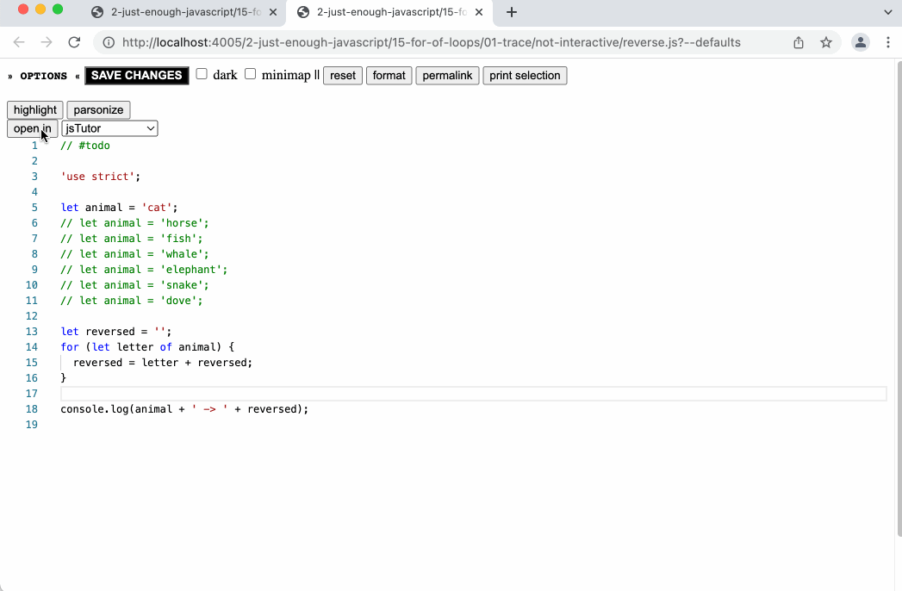
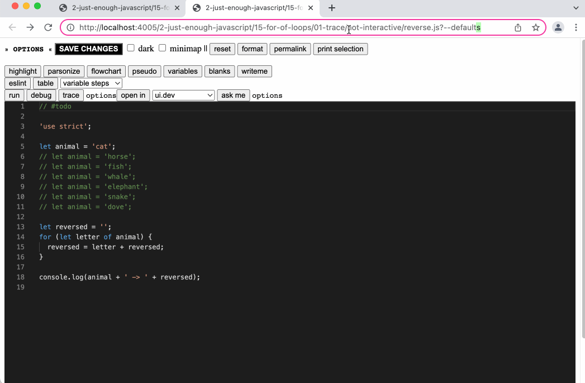

- you can open a whole file or a selection in a variety of online visualization tools, for now there's only a few but it's easy to add new ones (with a little poking in the source code)
	- content creators can configure which site is opened by default, depending on the learning objective
	- learners can still choose any one they like
- this feature exists as a button in [[Study Lenses/Study]]
	- 
- and as a separate lens -> `?open-in=<viztool>`
	- 
		-