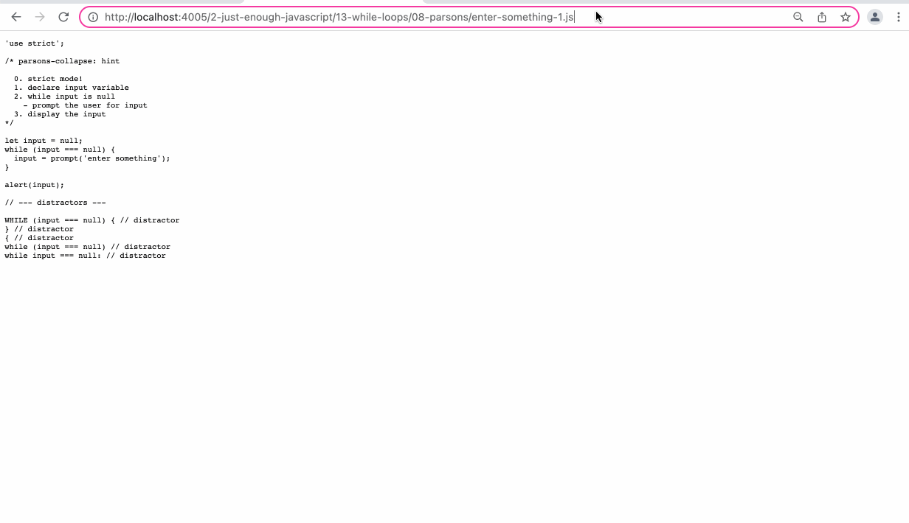

- converts code into a parsons problem
	- distractors are indicated with a `// distractor` comment
	- block comments with `parsons-collapse: hint` are rendered as collapsed hints
	- the number of distractors is indicated at the top of the exercise
	- feedback is given
	- indentation matters
	- (adapted from [js-parsons](https://js-parsons.github.io/))
- {:height 456, :width 778}
	-
	-