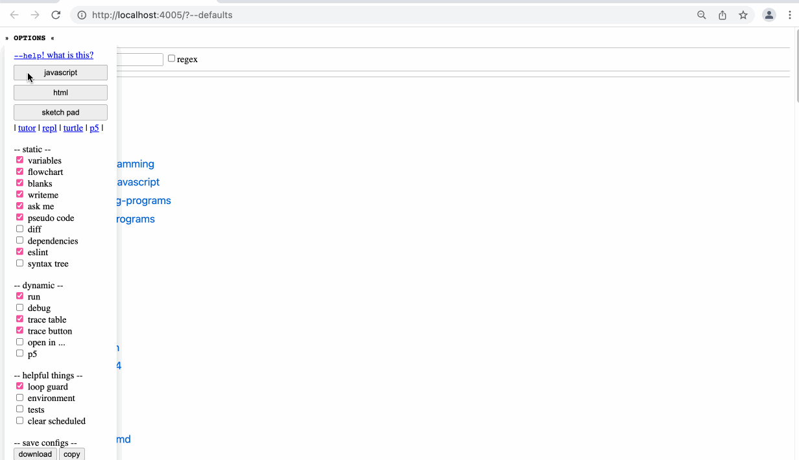
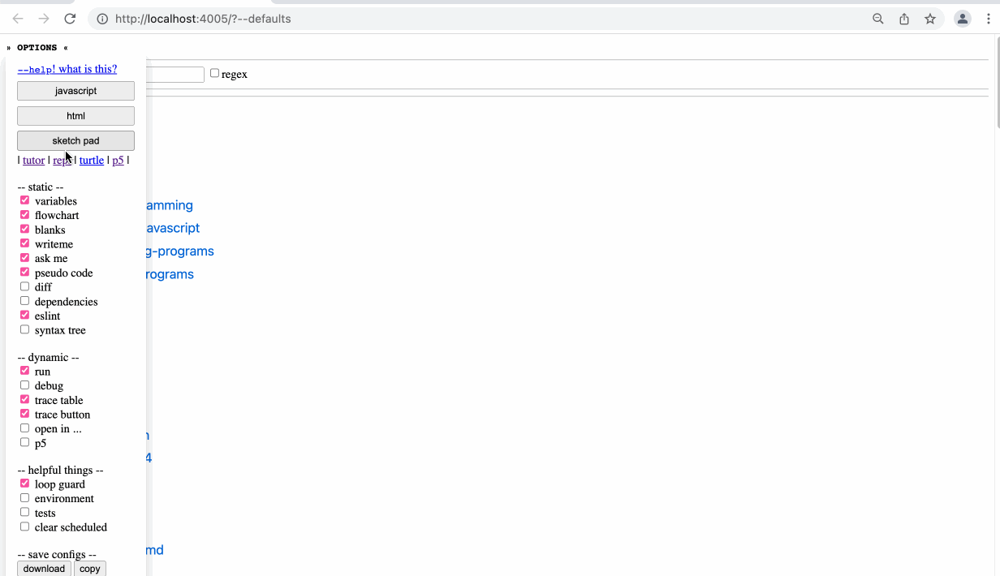

- sometimes you just want to work on a throw-away example, not a full file of code.  sandboxes!
- JS `?study` environment
  collapsed:: true
	- 
- JS repl
  collapsed:: true
	- 
- JS Tutor
  collapsed:: true
	- 
- HTML
  collapsed:: true
	- 
- Sketch pad
	- 
- p5 canvas
  collapsed:: true
	- 