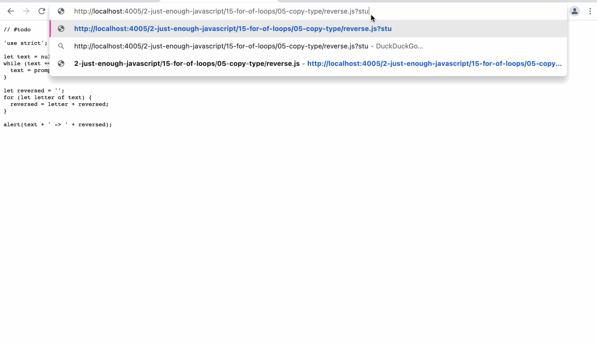
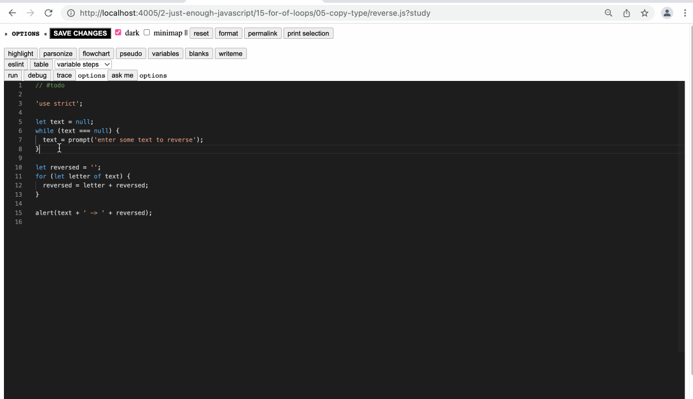
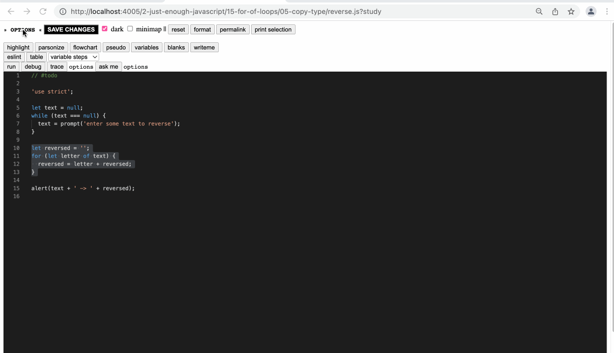

- the `?study` lens is "home base"
- from here you can edit a file, save changes, and use other study features
	- 
		-
- you can focus on one section of a program by highlighting those lines
	- 
- the content creator can decide which study options appear by default, but a learner can always override those configurations.  This is to accommodate the [[Expertise Reversal Effect]], and to allow learners to study any code they choose, not just code prepared by an educator
	- 