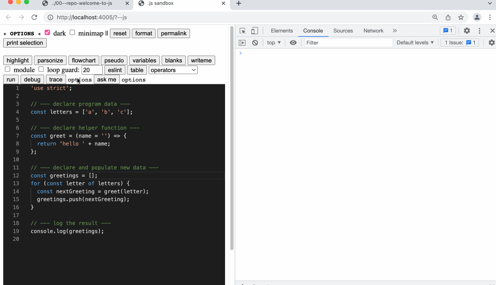

- Tracing is not easy to learn, and tracing doesn't help you if you learn to trace incorrectly. This isn't a problem when you have someone around who can help you, but what does someone need to learn tracing on their own? The trace button prints a configurable, human readable(ish) trace of a program to the console that learners can use to correct their trace tables.
	- learners can configure the trace to focus on different aspects of the program's execution
	- to help learn how to discuss a program's execution, the trace uses some technical vocabulary
	- the trace button can be used to check hand-written [Trace Tables]([[Study Lenses/Trace Tables]])
	- implemented using [[Aran]], a library for JavaScript instrumentation. (thank you Laurent!)
	- admittedly, it's not the most user friendly for now.  but it has potential
- tracing the same code with different configurations
	- 