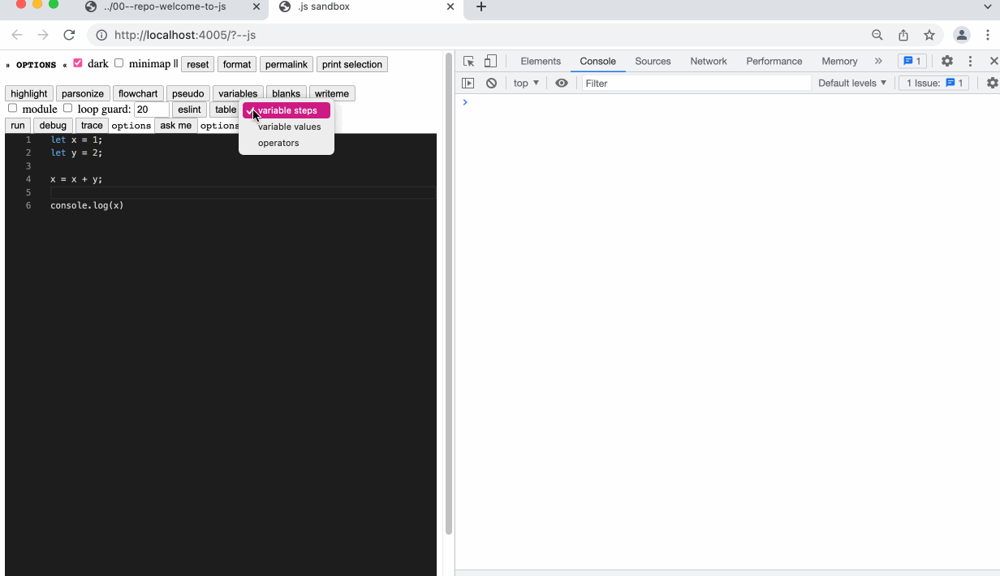
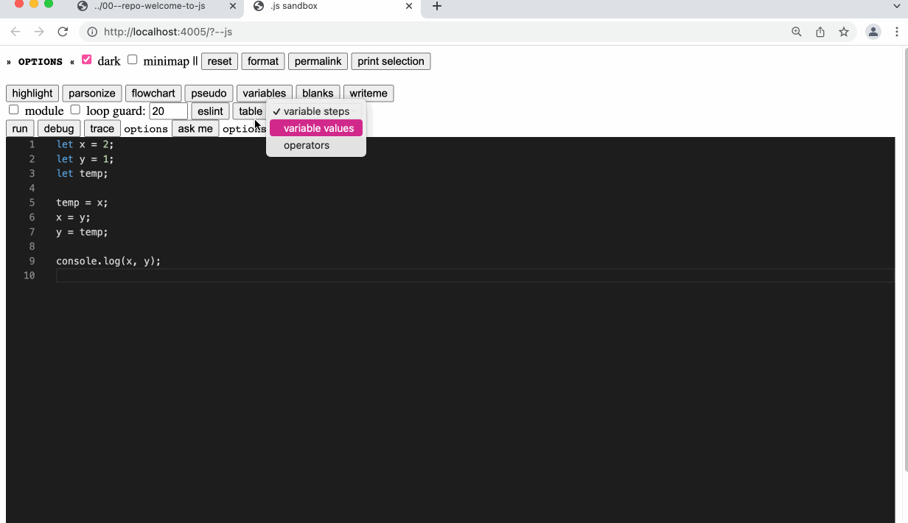
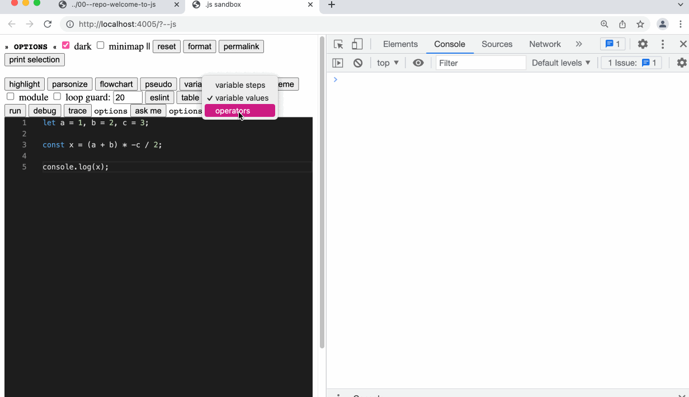

- Study lenses has different trace tables for studying different aspects of program behavior.  Each trace table can be checked using the [Trace Button]([[Study Lenses/Trace Button]]) to support self-study
	- this collection of tables has been adapted into a stand-alone [TraceTable Application](https://wise.vub.ac.be/project/personalised-technology-enhanced-learning-environments) by Yoshi.  the TraceTable app allows learners to export their trace tables as a data structure for automated grading
- tracing + checking variable steps
	- 
- tracing + checking variable assignments (traditional trace table)
	- 
- tracing + checking operators
	- 