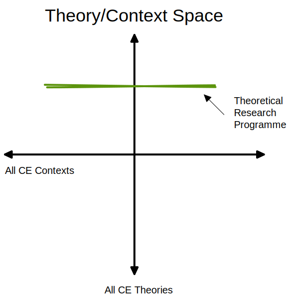

- the inverse of [[Translational Research Programmes]], [[Theoretical Research Programmes]] aim to build our abstract understanding of [[CER]] by exploring a narrow set of theoretical constructs across a variety of contexts:
	- 