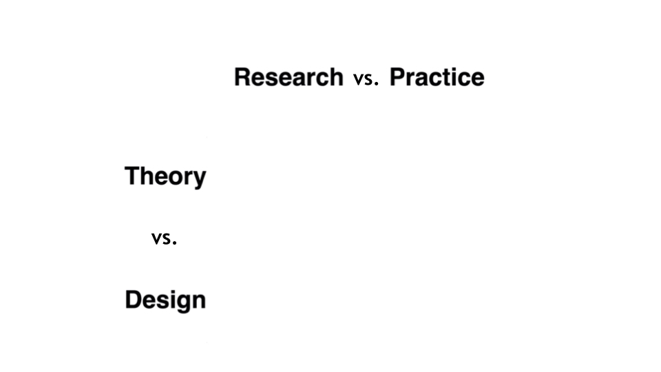
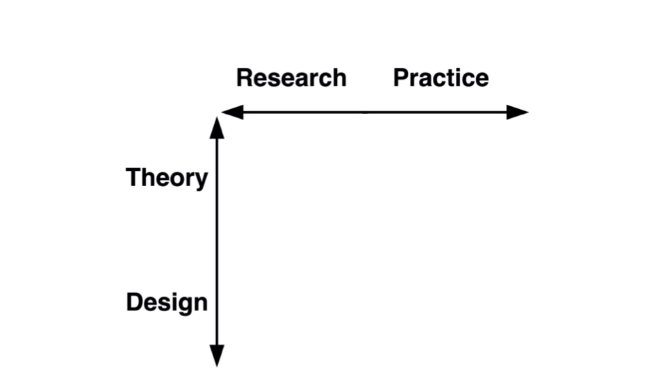
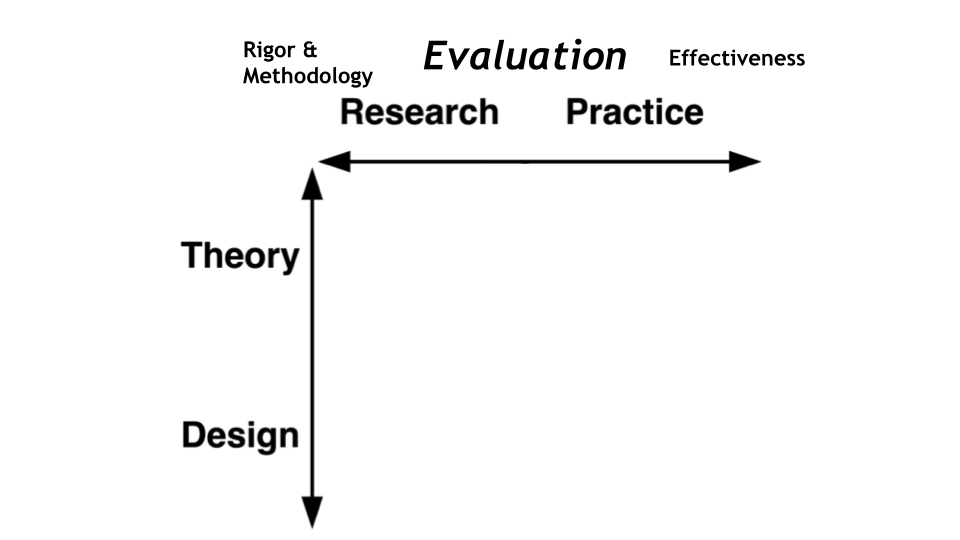
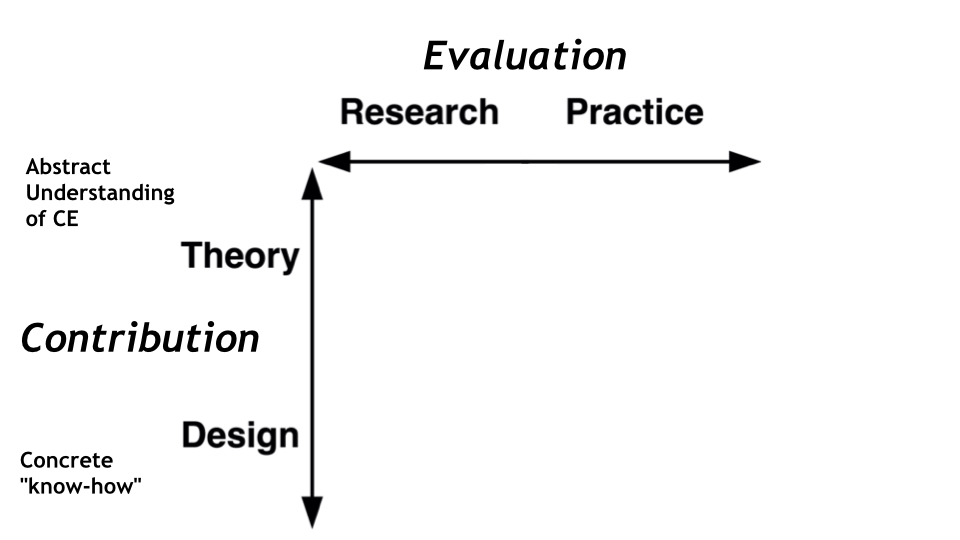
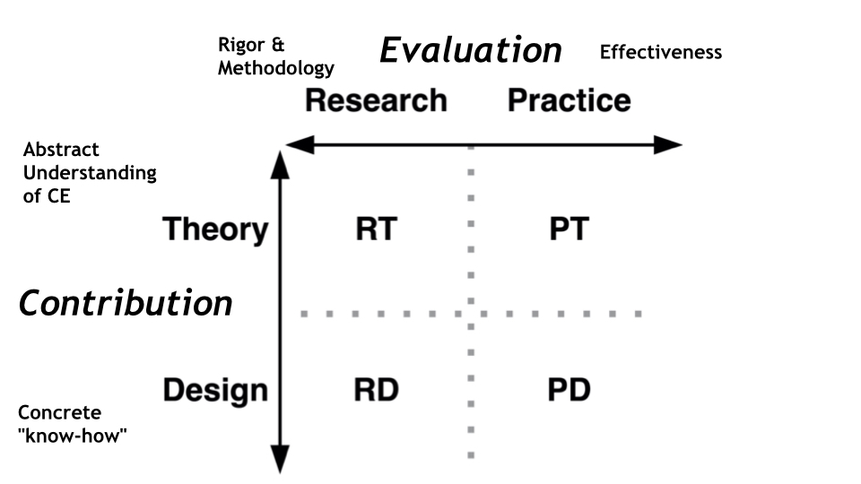
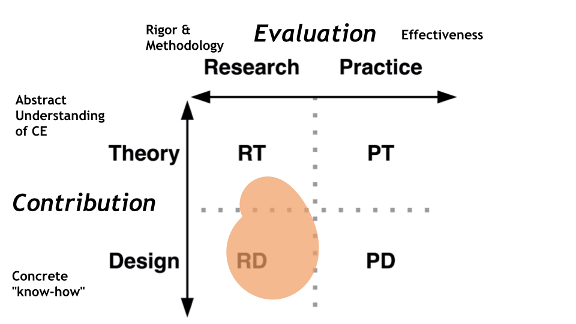
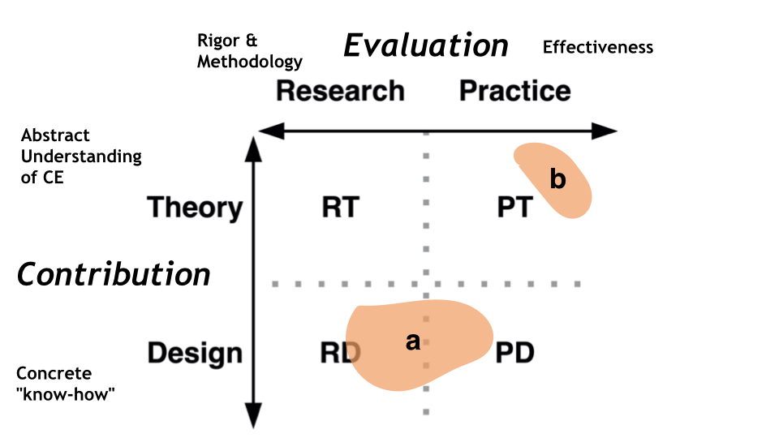
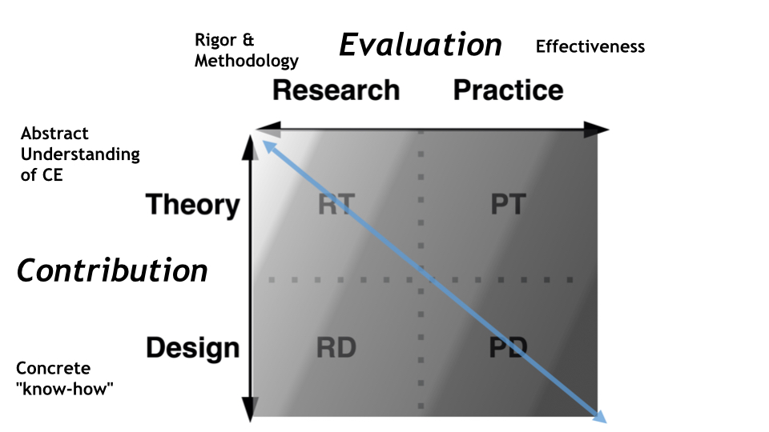
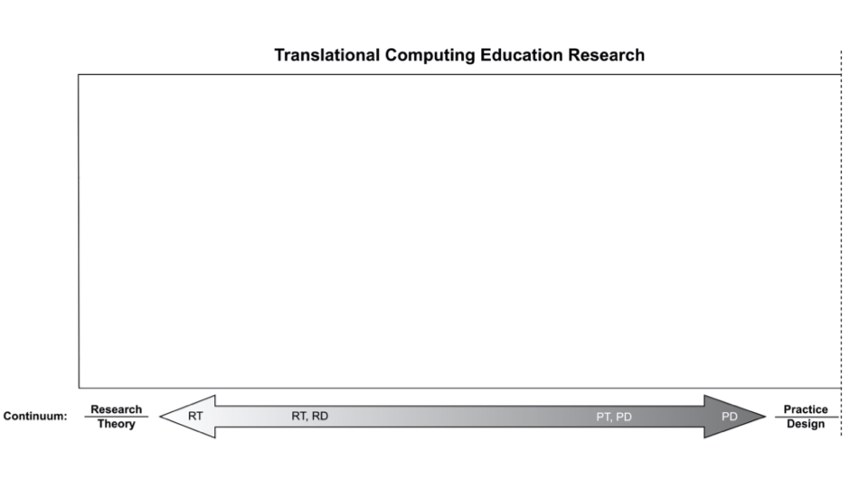

- (this page is an expanded explanation of the Translational Continuum defined in the [TCER Model]([[Computing Education Research as a Translational Transdiscipline]]))
- To understand the Translational Continuum in CER, first understand 2 substantial divides that are blocking [CER]([[Computing Education Research]]) from reaching it’s full potential to impact [CE]([[Computing Education]]).
- The first divide is between [CER]([[Computing Education Research]]) and [CE]([[Computing Education]]) more broadly: advances in research do not translate into more effective CE at the rate you'd hope.  This is partly an issue within CER, but also the result of a divide between CER and broader CE.  More often than not, people I've met or worked with are not even aware that there is an academic field of CER. And when they are aware of it, there are few clear ways to access or apply best practices
	- 
- The second divide is within CER: advances in [theory]([[Grand Theories or Design Guidelines? Perspectives on the role of theory in Computing Education Research]]) do not translate into [improved learning designs]([[On Use of Theory in Computing Education Research]]).  There may be progress in theory development and in learning designs, but they are not always informing each other.  Recognizing this divides comes not from first-hand experience but from exploring the CER literature (see the first paragraph of [TCER]([[Computing Education Research as a Translational Transdiscipline]]) for citations).
	- {:height 428, :width 747}
- To begin reconciling these divides, you must first change your perspective.  Instead of considering them as divides, what if they were continuua?  What if what you thought are separate things, are instead just two extremes on one sliding scale?
	- 
- The first continuum is research/practice, defined by how something is evaluated: is the rigor and methodology what matters? Or is the effectiveness what matters?
	- 
- The second continuum is the theory/design continuum: Does something contribute to our abstract understanding of computing education? Or does it contribute more concrete "know how" in computing education?
	- 
- Putting it all together: This 2D continuum can be divided loosely into 4 categories of work/artifact in CER defined by their evaluation and contributions.  The continuum should be thought of as a tool for discussing and analyzing work in CR, not as a classification system for confining or excluding work.
	- 
- Blobs are more useful than coordinates when using the continuum, some work may have more emphasis on rigor and know-how, but still some contributions to abstract understanding.  For example, an empirical evaluation of a new learning environment deployed in a university may also be used as evidence to support a novel learning theory.
	- 
- And a single research project may be non-continuous over this space.  For example a two-part research project may include (A) a rigorous evaluation of a novel exercise that is (B) synthesized into evidence-based but non-rigorous guidelines for practitioners.
	- 
- To use this 2d space in the [TCER model]([[Computing Education Research as a Translational Transdiscipline]]), reduce it to 1d by drawing a line diagonally from RT to PD: from rigorous understanding to effective know-how.  This diagonal best captures the intuition of an « academic » to « non-academic » translational continuum, progressing from fundamental understanding of CE to an artifact that's classroom-ready.
	- 
- Flatten that spectrum and you have the foundation of [TCER model]([[Computing Education Research as a Translational Transdiscipline]]).  This represents the belief that [all contributions]([[The Different Types of Contributions to Knowledge (in CER): All Needed, but Not All Recognised]]) are necessary for CER to succeed, each contribution simply plays a different role along the translational spectrum and should be welcomed for what it offers, not criticized for what it doesn’t.
	- 
-