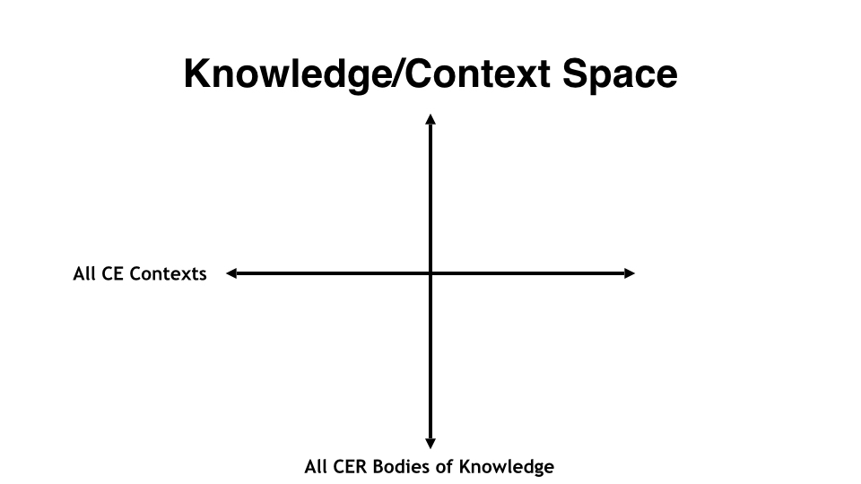
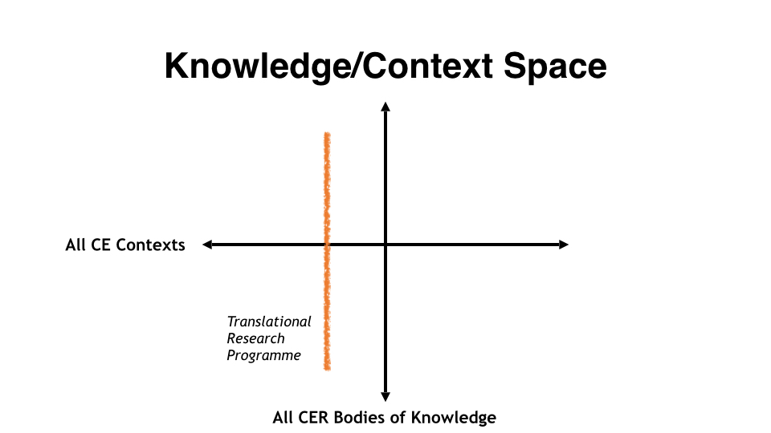
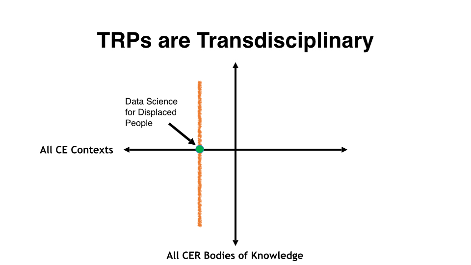
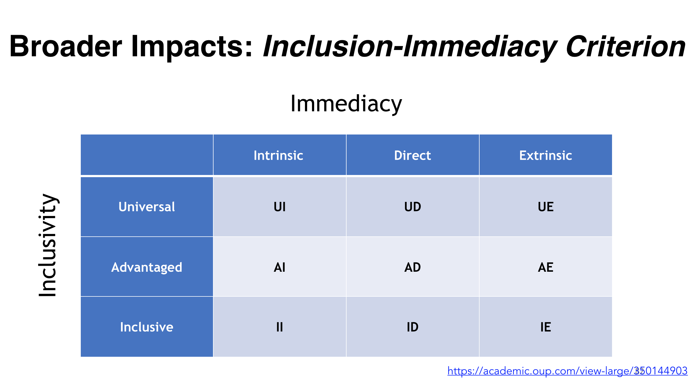

- (this page is a much simpler but more visual explanation of TRPs as defined in the [TCER Model]([[Computing Education Research as a Translational Transdiscipline]]))
- The TCER Model doesn't exist for academic discussion, we wrote this model to imagine how CER can come to life, become more accessible to practitioners, and more intentionally have a [[Broader Impact]] in society.  Translational Research Programmes are one way to turn the static model to a dynamic transdiscipline. By coordinating diverse research projects dealing with different aspects of the same problem over longer periods of time, TRPs can address challenges in CE that are too complex or diffuse for a single researcher or institution.
	- To be clear, not all research in CER should be translational.  There should always be a place for curiosity-driven research with no guaranteed "pay off" in practice.
- To begin explaining TRPs, consider this (oversimplified) space of all CER knowledge on one axis, and all computing education contexts on the other.
	- 
- You can imagine a TRP as this orange line, it will tap into all bodies of CER knowledge to impact a single computing education context
	- 
- Take as an example developing a data science course to help displaced people take control of their lives.
	- For such a project to succeed you cannot only focus on the learning objectives, instructional design and lesson plans.  You will also need to collaborate with local & regional employers, integration services, aid organizations, and the learners themselves.
	- It’s not possible to isolate such a challenge and develop solutions in a controlled setting.   There are practical, social and psychological factors that simply can’t be ignored without redefining your target context.
	- CER specialists working on such a TRP would need to approach the project with open ears and offer their expertise in service of the project, not the other way around.
	- 
-
- While a TRP interacts with all 5 phases of TCER, the phases are not practical for _planning_ a TRP.
	- for planning purposes [process markers]([[Evaluating Translational Research: a Process Marker Model]]) and [[Agile CER]] would be more useful
	- to plan and evaluate the [[Broader Impact]]s of a TRP, the [inclusion-immediacy criterion]([[Impacts for whom? Assessing inequalities in NSF-funded broader impacts using the Inclusion-Immediacy Criterion]]) can be helpful: 
- References
	- [[Evaluating Translational Research: a Process Marker Model]]
	- [[Computing Education Research as a Translational Transdiscipline]]