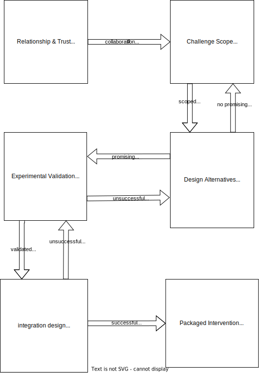

- ## Abstract
	- Translational Sprints (TSs) are a work-in-progress model for delivering rapid and affordable improvements to a curriculum in [participation]([[Participatory CER]]) with learners and educators. This model arose in response to questions such as:
		- {{embed ((63f75350-4779-410a-b9f0-168cab1faf2a))}}
	- Translational Sprints apply qualitative, quantitative and design methodologies across 6 different stages:
		- 0. Relationship & Trust: get acquainted and establish expectations for culture, power and trust.
		  1. Challenge Scope: identify a challenge that can be addressed within your constraints.
		  2. Design Alternatives: design possible interventions based on experience and theory. #phase/2/a
		  3. Experimental Validation: test interventions in a controlled setting. #phase/2/b
		  4. Integration Design: integrate validated interventions into the curriculum. #phase/4/a #phase/4/b
		  5. Intervention Packaging: document and publish interventions for educators facing similar constraints, and share your research methods for replication. #phase/5/a
	- Progress through the stages is cyclical; it is necessary to return to previous stages when you reach a dead end. Based on experience, working with limited resources, predecessors to this model have proven effective which encourages us to share our model as a blueprint. We are looking for research collaborators and for educators interested in testing Translational Sprints in their class. As a first step we intend to target affordable, short-term professional trainings as they can improve a learner’s career prospects, their shorter time frame enables rapid iteration, and they are generally free to innovate.
	- Each sprint can be written up as an academic publication regardless of whether or not a successful intervention was found. Share your failures!
- ## Translational Sprint Diagram
	- 
- ## Motivations
	- Our experience as educators working outside of academic institutions in short-term professional trainings has made it clear to us that many learners and educators are not aware of Computing Education Research (CER), much less benefiting from it. Our primary motivation for pursuing Translational Sprints (TS) is exploring new ways to co-create quality, relevant, evidence-based education for all learners. This requires balancing the interests of many stakeholders including researchers, educators, learners and industry partners. There have been research programs with a structure similar to Translational Sprints [^1], but we are not aware of a well-defined model for this type of work.
	- We are also aware of limited diversity in the tech industry and the problems this creates for society. Broadening access to quality computing education is one step to increase representation in tech, building towards a future where the tech industry contributes to opportunity and social equity. However, social impact is not guaranteed by Translational Sprints but will require a conscious effort from researchers, educators, learners as well as industry partners.
	- Finally, we are looking for a way to balance competing interests in our own careers including; Making computing education open, usable, useful and used. Keeping a connection to the classroom. Contributing to the body of CER knowledge. and Staying in touch with best practices in development. Hopefully Translational Sprints can be one piece of the puzzle for us and others seeking to find a balanced career.
- ## Contributions
	- We believe the most significant contribution of [[Translational Sprints]] is to imagine a “native” R&D methodology for [[Computing Education Research]]. Translational Sprints borrow from academic research, instructional design, agile development and [[Open Education]] to imagine how researchers and practitioners can work together [^2] to build new knowledge and improve learning outcomes. Translational Sprints can also provide opportunities for researchers to develop domain- and context-specific learning theories [^3] that are only possible with the direct participation of learners and strong [[Research-Practice Partnership]]s. Finally, if practiced with transparency, we believe Translational Sprints offer a unique opportunity for educators to introduce the principles of research, design, collaboration, and project management. Depending on their level of experience, learners could even work alongside researchers improving their own education.
	  id:: 6401c5cd-5062-4d6a-9bda-41c0af0b1bd7
- ## References
	- [^1]: [[The Different Types of Contributions to Knowledge (in CER): All Needed, but Not All Recognised]]
	- [^2]: [[Negotiating Trust, Power and Culture in a Research-Practice Partnership]]
	- [^3]: [[Development and Use of Domain-specific Learning Theories, Models and Instruments in Computing Education]]
	- residing in the "praxis" realm of [[Computing Education Research as a Translational Transdiscipline]]